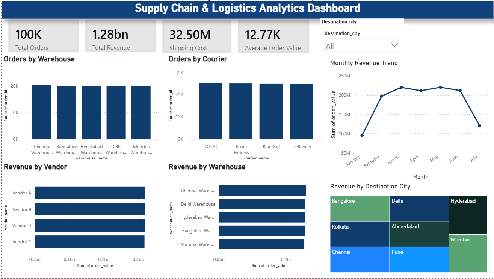

# 📦 Supply Chain & Logistics Analytics Dashboard

A Power BI dashboard built using SQL and Power BI to analyze supply chain and logistics operations. The dashboard provides interactive insights into orders, revenue, shipping costs, warehouse performance, courier performance, vendor revenue, and destination-wise analysis.

---

# 📸 Dashboard Preview



---

## 📌 Project Overview

This project transforms raw Supply Chain and Logistics data into an interactive Business Intelligence dashboard using SQL and Power BI. It enables users to monitor operational performance and gain insights through interactive charts, KPI cards, and filters.

---

## 🎯 Objectives

- Analyze Total Orders
- Calculate Total Revenue
- Analyze Shipping Costs
- Calculate Average Order Value
- Compare Warehouse Performance
- Compare Courier Performance
- Compare Vendor Revenue
- Analyze Destination City Distribution

---

## 🛠️ Tech Stack

- PostgreSQL
- SQL
- Power BI
- DAX
- Git
- GitHub

---

## 📊 Dashboard KPIs

| KPI | Description |
|------|-------------|
| 📦 Total Orders | Total number of orders processed |
| 💰 Total Revenue | Overall revenue generated |
| 🚚 Shipping Cost | Total logistics cost |
| 📈 Average Order Value | Average revenue generated per order |

---

## 📈 Dashboard Visualizations

- 📦 Orders by Warehouse
- 🚚 Orders by Courier
- 💰 Revenue by Vendor
- 🏢 Revenue by Warehouse
- 🌍 Destination City Filter

---

## 💡 Key Insights

- Revenue distribution across warehouses can be compared easily.
- Courier workload is balanced across service providers.
- Vendor-wise revenue highlights top-performing vendors.
- Destination city filtering enables dynamic business analysis.

---

## 📂 Repository Structure

```text
Supply-Chain-Logistics-Dashboard/
│
├── README.md
├── Screenshot 2026-07-19 030153.png
└── Supply_Chain_Logistics_Dashboard.pbix
```

---

## 🚀 How to Run

1. Clone this repository

```bash
git clone https://github.com/haricharan-18/Supply-Chain-Logistics-Dashboard.git
```

2. Open

```
Supply_Chain_Logistics_Dashboard.pbix
```

using **Power BI Desktop**.

3. Explore the dashboard using the Destination City slicer.

---

## 📷 Dashboard Features

- Executive KPI Cards
- Interactive Slicer
- Warehouse Analysis
- Courier Analysis
- Vendor Revenue Analysis
- Clean Business Dashboard Design

---

## 📌 Future Improvements

- Time-series Sales Analysis
- Customer Segmentation
- Forecasting using Power BI
- Additional DAX Measures
- Drill-through Pages

---

## 👨‍💻 Author

**Haricharan**

GitHub: https://github.com/haricharan-18

---

⭐ If you found this project useful, consider giving it a star!

